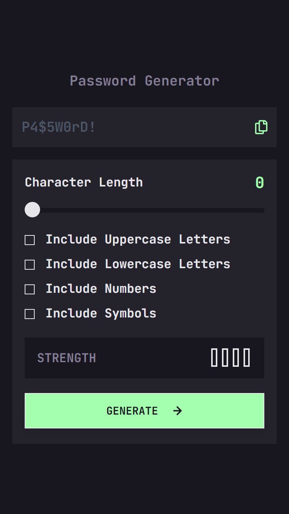

<h1 align="center">Password Generator</h1>
A beautiful password generator app built with React, TypeScript,Styled-Component and Tailwind CSS.  

## Table Of Contents

  - [Overview](#overview)
  - [Links](#links)
  - [Challenge](#challenge)
  - [Screenshot](#screenshot)
  - [Built with](#built-with)
  - [Getting started](#getting-started)
  - [What I learned](#what-i-learned)
  - [Project structure](#project-structure)
  - [Author](#author)

 
### Overview
This password generator app provides users with a secure and convenient way to create strong passwords.

### Links
- [see live](https://password-generator-005c.netlify.app)

### The challenge

Users should be able to:

- Generate a password based on the selected inclusion options
- Copy the generated password to the computer's clipboard
- See a strength rating for their generated password
- View the optimal layout for the interface depending on their device's screen size
- See hover and focus states for all interactive elements on the page

### Screenshot

  

  

### Built with
- [React](https://react.dev/): A JavaScript library for building user interfaces.
- [TypeScript](https://www.typescriptlang.org/docs/handbook/typescript-in-5-minutes.html): A       superset of JavaScript that adds optional static typing.
- [Styled-Component](https://styled-components.com/docs): For styling component.
- [Tailwind CSS](https://tailwindcss.com/docs/guides/vite): A utility-first CSS framework for rapid UI development.

### Getting Started
 
 Follow these steps to run the project locally:

- Clone the repository
  - git clone https://github.com/bra-charles/passwordgenerator.git
- Navigate to the project directory
  - cd passwordgenerator
- Install dependencies:
    - npm install
- Start the development server:
    - npm run dev        
  This will start the development server and open the app in your browser, typically at http://localhost:5173/.

 ### What I Learned
  I learned to leverage styled-components for creating beautiful, maintainable styles in my React components. This included using CSS-in-JS techniques for dynamic styling, implementing responsive design with media queries, and creating reusable, modular components. This experience enhanced my skills in building scalable and visually appealing applications.

### Project Structure
- src/
   - App.tsx: Main application component.
   - Assets/images
     - icons-arrow-right.svg: Svg for a right arrow used in the GENERATE button.
     - icons-copy.svg: Svg for copy to clipboard.  
   - components/

     - ArrowRightSvg.tsx: Component for an icon-arrow-right svg file. 
     - CopyIconSvg.tsx: Component for an icons-copy svg file. 
     - IncludeLowercase.tsx: Component for including lowercase letters.
     - IncludeNumbers.tsx: Component for including numbers.
     - IncludeSymbols.tsx: Component for including symbols.
     - IncludeUppercase.tsx: Component for including uppercase letters.
     - PasswordLength.tsx: Component for changing password length.
     - MainPasswordStrength.tsx: Component for displaying password strength.    
     - PasswordStrengthColorBox.tsx: Component for color boxes to display password strength levels.
     - PasswordStrengthMeter.tsx: Component for   
   - utils/
     - generatePassword.ts: Utility functions.
     - passwordStrength.ts: Utility functioons.  
- tailwind.config.js: Tailwind CSS configuration.
- package.json: Project dependencies and scripts.
- README.md: This file (you're reading it now!)

### Author
  Charles Adu Nkansah
- GitHub: [@bra-charles]()
- LinkedIn: [@charles](https://www.linkedin.com/in/charles-adu-nkansah/)
